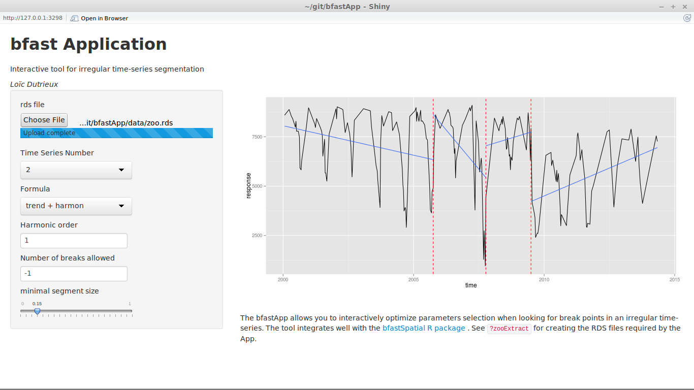

# bfastApp
*Loïc Dutrieux*

### *An application to interactively select function parameters when segmenting irregular time-series*

The application particularly focuses on irregular time-series, extracted from multi-temporal remote sensing data such as Landsat time-series. An integration with the bfastSpatial package makes it easy to extract the objects that need to be uploaded to the app. Below is a quick tutorial on how to use the app.

First if you have not yet installed the [bfastSpatial](https://github.com/dutri001/bfastSpatial) package, you should do so by running the following command.

```r
devtools::install_github('dutri001/bfastSpatial')
```

The bfastSpatial contains a built in dataset from which we will extract the time-series objects which will be later fed to the app. The object is named tura, it is a rasterBrick object with time stored in the Z dimension. Each layer correspond to NDVI calculated from a Landsat scene acquired at a different date.

```r
# Load and visualize tura object
library(bfastSpatial)
data(tura)
plot(tura, 3)

# In case an object does not have time written to the z dimension, it can be done as follows
setZ(tura, getSceneinfo(names(tura))$date)
```

We will extract sample time-series using the `zooExtract()` function of the bfastSpatial package. The function works by extracting the time-series of individual pixels at locations specified by a SpatialPoints object. Therefore we need to generate that object since we do have one yet. However, such file could come from a shapefile for instance containing reference in-situ data. A regular sample can be achieved using the `sampleRegular()` function from the raster package.

```r
# Generate SpatialPoints object and visualize
sp <- sampleRegular(tura, size = 40, sp=TRUE)
plot(tura, 3)
plot(sp, add=TRUE)
```

```r
# Extract samples and prepare rds file
zooExtract(x = tura, sample = sp, file = 'turaZoo.rds')
```

Now the file is stored in your working directory, ready to be opened in the application.

### Running the App

The app requires a set of packages that need to be installed prior to running it. In case you do not have installed you, run the following command.
```r
install.packages('shiny', 'zoo', 'bfast', 'strucchange', 'ggplot2')
```

The app can be ran more or less directly from github, using the `runGitHub` function.
```r
library(shiny)
runGitHub(repo = 'bfastApp', username = 'dutri001')
```

Point to the turaZoo.rds file that you have saved in an earlier step, and you're ready to explore your time-series objects.

